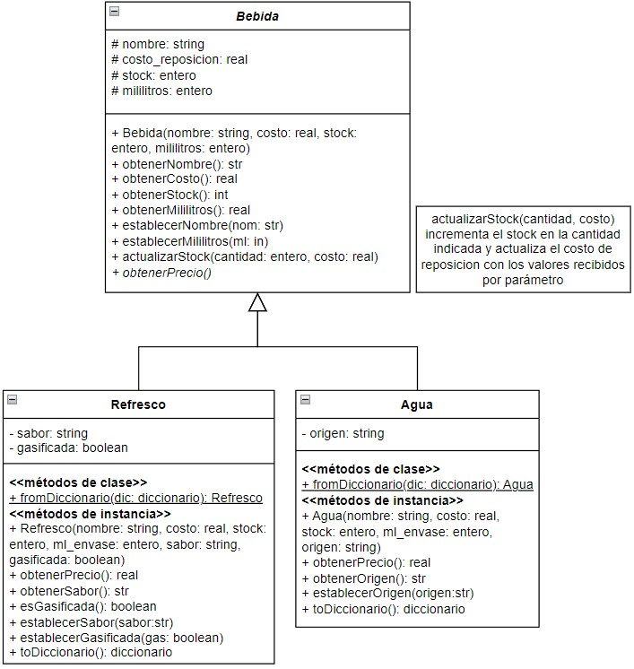

# Segundo parcial - Tema 2

## API de bebidas para el sector Kids de la Taberna de Moe

Moe desea implementar en su taberna un sector con juegos dedicado a los hijos de sus clientes, y ofrecerá bebidas sin alcohol.
Para ello quiere una API que le permita gestionar estas bebidas.

Moe quiere establecer los precios de las bebidas de forma distinta:
- El precio de venta de los jugos y gaseosas (refrescos) surge de incrementar un 50% el costo de reposición.
- El precio de venta de las aguas minerales se calcula como el costo de reposición más un 30%.

Las bebidas están modeladas de la siguiente manera:

1. Moe comenzó a desarrollar la API pero no la terminó. Completá lo que falta y corregí los errores que cometió Moe. Donde corrijas un error agregá un comentario indicando el error corregido.
